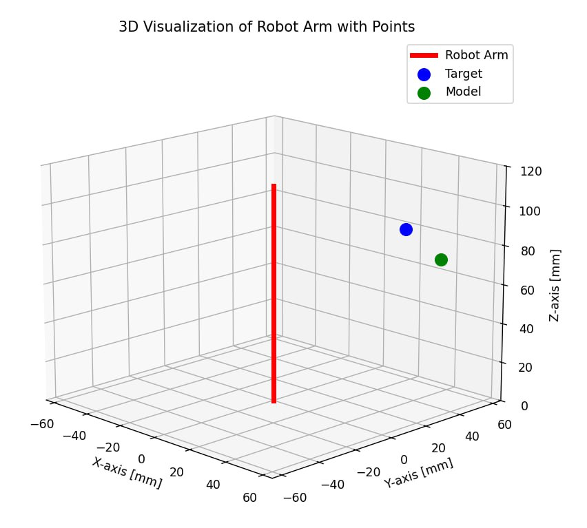
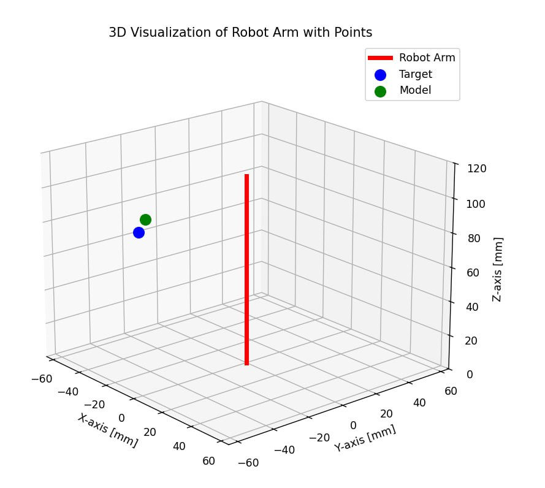

# Continuum Robot Simulation and Training

## :pencil2: Description

This project implements the Deep Deterministic Policy Gradient (DDPG) algorithm for training an agent in a three-dimensional environment. The main goal is to create a model that can optimally interact with a complex environment, making decisions based on continuous actions.

## :file_folder: Project structure

- `model.py` : Implementation of the mathematical model of the robot.
- `DDPG.py` : Model training
- `environment.py` :Gym environment for robot simulation.
- `test.py` : Testing a trained agent.
- `visualization.py` : Visualization of the robot in 3D space.

## :checkered_flag: Features

- Simulation of the motion of a continuum robot in 3D space.
- Visualization of robot.
- Support for custom reward functions.

## :zap: Getting Started

### :mortar_board: Model training

Run `DDPG.py` to start learning:

```bash
python DDPG.py
```

### :computer: Testing the model

Run `test.py` to test the trained model:

``` bash
python test.py
```

### :globe_with_meridians: Visualization

Run `visualization.py` to see the robot's work in 3D space:

```bash
python visualization.py
```

## The process of training and testing the robot

<!DOCTYPE html>
<html lang="en">
<head>
  <meta charset="UTF-8">
  <meta name="viewport" content="width=device-width, initial-scale=1.0">
  <title>Centered Images</title>
  <style>
    body {
      display: flex;
      justify-content: center;
      align-items: center;
      min-height: 100vh;
      margin: 0;
      background-color: #f5f5f5;
    }
    .image-container {
      display: flex;
      justify-content: center;
      align-items: center;
      gap: 20px;
    }
    .image-container img {
      width: 50%;
      max-width: 300px;
      border: 2px solid #ccc;
      border-radius: 8px;
    }
  </style>
</head>
<body>
  <div class="image-container">
    
    
  </div>
</body>
</html>


## :bookmark_tabs: Сonclusion

The results of the project demonstrate the effectiveness of the DDPG algorithm for training an agent in complex environments with continuous actions. The use of neural networks for policy and criticism allowed us to achieve a high level of adaptation of the agent to new environmental conditions.
Further improvements may include optimizing hyperparameters, extending the model architecture, or implementing additional mechanisms such as prioritized repetition experience or more complex reward functions.

