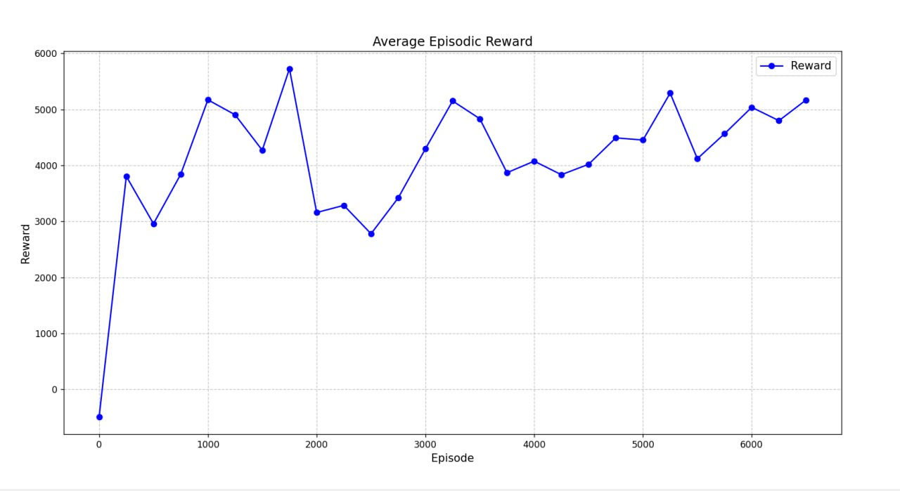

# Continuum Robot Simulation and Training

## :pencil2: Description

This project implements the Deep Deterministic Policy Gradient (DDPG) algorithm for training an agent in a three-dimensional environment. The main goal is to create a model that can optimally interact with a complex environment, making decisions based on continuous actions.

## :file_folder: Project structure

- `model.py` : Implementation of the mathematical model of the robot.
- `DDPG.py` : Model training
- `environment.py` :Gym environment for robot simulation.
- `test.py` : Testing a trained agent.
- `visualization.py` : Visualization of the robot in 3D space.

## :checkered_flag: Features

- Simulation of the motion of a continuum robot in 3D space.
- Visualization of robot.
- Support for custom reward functions.

## :zap: Getting Started

### :mortar_board: Model training

Run `DDPG.py` to start learning:

```bash
python DDPG.py
```

### :computer: Testing the model

Run `test.py` to test the trained model:

``` bash
python test.py
```

### :globe_with_meridians: Visualization

Run `visualization.py` to see the robot's work in 3D space:

```bash
python visualization.py
```

## The process of training and testing the robot

### Function to reward and punish the robot during training

```python
new_distance == old_distance: 
            reward = -100.0
        else:
            if new_distance < 5.0: 
                reward = 200.0
            elif new_distance < 10.0:
                reward = 100.0
            elif new_distance < 20.0:
                reward = 50.0
            else:
                reward = old_distance - new_distance
```

### Graphs showing the process of robot training
<div style="display: flex; justify-content: center; align-items: center">

<div style="display: block; justify-content: center; align-items: center; gap: 20px;">
  
</div>

<div style="display: block; justify-content: center; align-items: center; gap: 20px;">
  
</div>
</div>

### From the following graph we can see that the average distance between the target point and the point what gives the model is 15.78 mm.

- In 15% of the cases, the distance is less than 3 mm, which realistically means that the model has chosen the absolutely correct action to reach the target.
- In 69.5% of the cases the model gives a distance less than 20 mm, which is also close enough.
- In 3.5% of cases the model gives a distance greater than 40 mm, which realistically means that the model has chosen the wrong action

<div style="display: flex; justify-content: center; align-items: center; gap: 20px;">
  
</div>

## The graph shows the average rewards during learning for every 200 episodes

<div style="display: flex; justify-content: center; align-items: center; gap: 20px;">
  
</div>

## :bookmark_tabs: Сonclusion

The results of the project demonstrate the effectiveness of the DDPG algorithm for training an agent in complex environments with continuous actions. The use of neural networks for policy and criticism allowed us to achieve a high level of adaptation of the agent to new environmental conditions.
Further improvements may include optimizing hyperparameters, extending the model architecture, or implementing additional mechanisms such as prioritized repetition experience or more complex reward functions.
